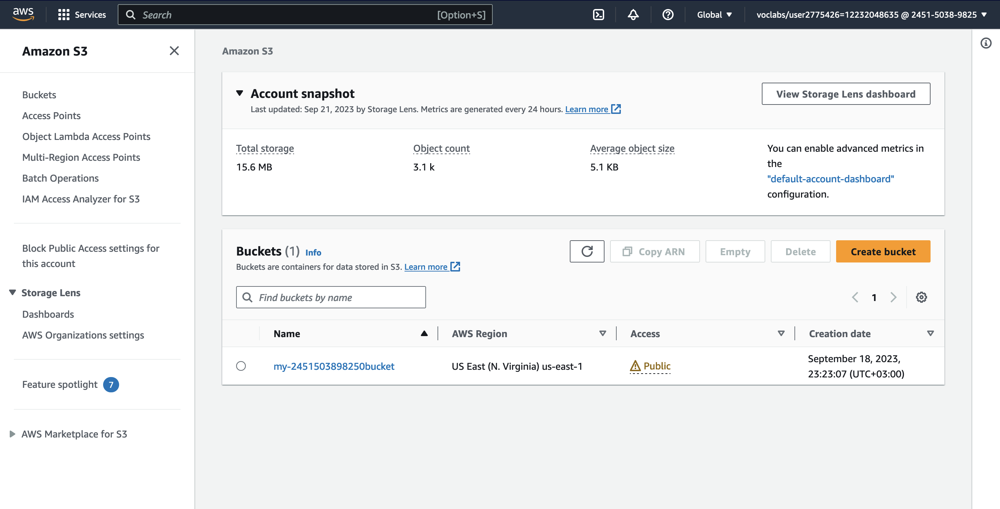
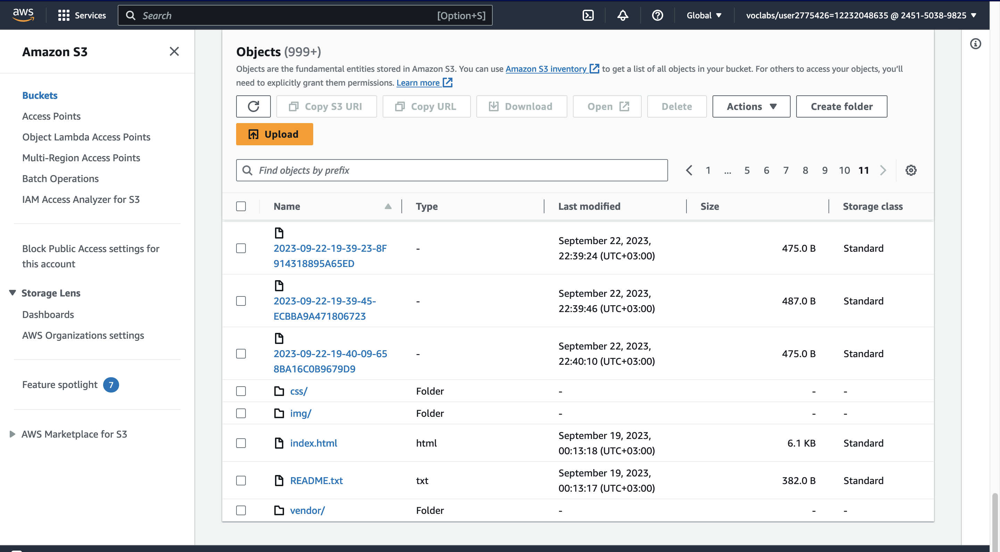
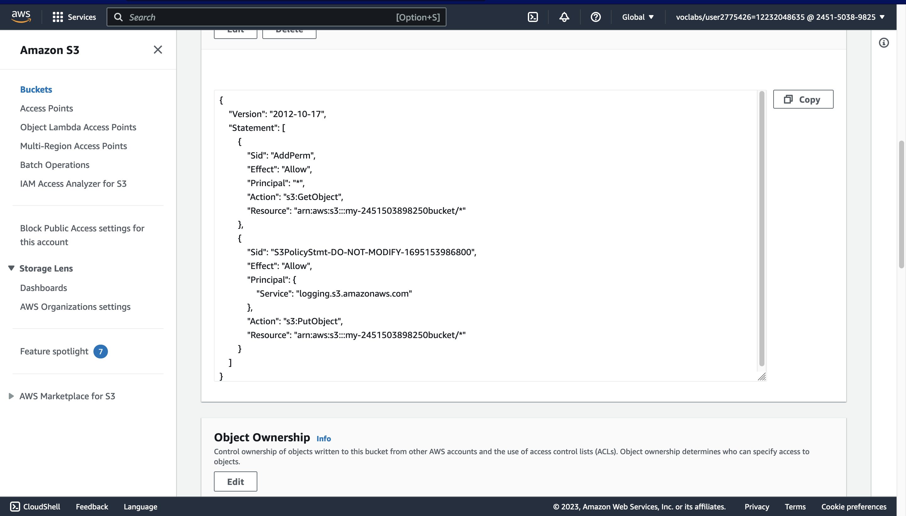
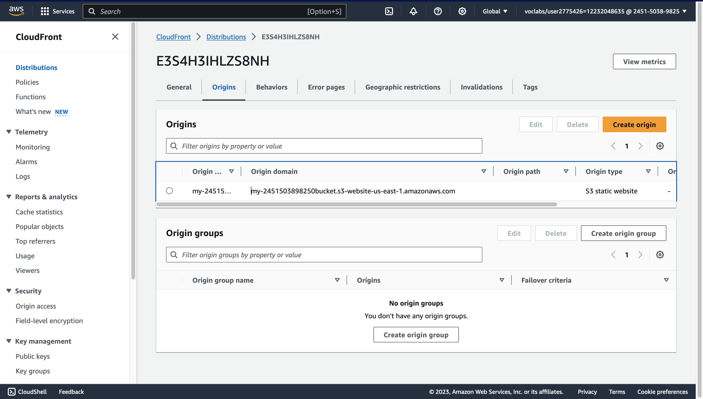

# Static Website Deployment on AWS

This repository contains the necessary files and instructions for deploying a static website to Amazon Web Services (AWS). Static websites are ideal for hosting HTML, CSS, and JavaScript files that do not require server-side processing.

## Project Overview

The cloud is a great choice for hosting static websites due to its scalability and cost-effectiveness. In this project, we will:

1. **Create S3 Bucket:** We'll set up an AWS S3 (Simple Storage Service) bucket to store our website files.

2. **Configure Bucket for Website Hosting:** We'll configure the S3 bucket to serve as a website host.

3. **Secure the Bucket:** We'll enhance security using AWS IAM (Identity and Access Management) policies.

4. **Upload Website Files:** All website content, including HTML, CSS, JavaScript, and images, will be uploaded to the S3 bucket.

5. **Speed Up Content Delivery:** We'll improve website performance by leveraging AWS CloudFront, a content delivery network (CDN).

6. **Access the Website:** Finally, we'll provide instructions on how to access the deployed static website.

## File Summary

- `index.html`: The main HTML document for the website.
- `/img`: Folder containing the background image for the website.
- `/vendor`: Folder with Bootstrap CSS framework, fonts, and JavaScript libraries.
- `/css`: Folder containing CSS files for the website.

## Getting Started
1. Create an S3 bucket, and make sure to leave the 'Block all public access' option unchecked.
   
   
3. Upload the files to the S3 bucket.

4. Change the Bucket Policy according to your Bucket Policy file.
   
5. Make the bucket to host a website.
    
6. Use the CloudFront dashboard to create a distribution.
   
   
8. Open a web browser paste the copied endpoint URL and append “/index.html” on the end.
    
